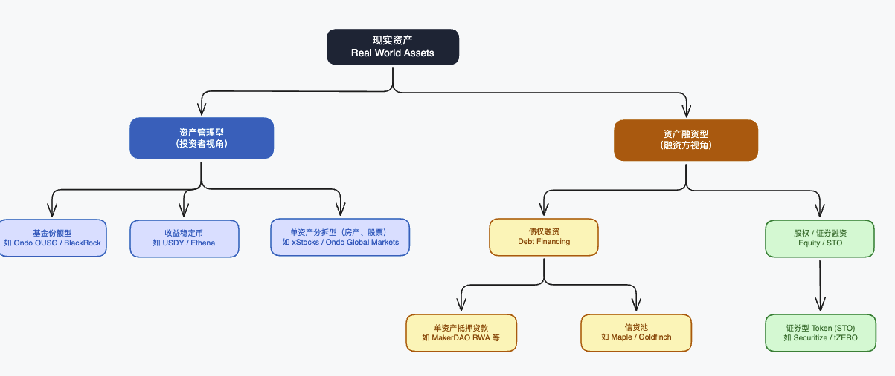

# RWA Research

Real World Assets (RWA) 调研笔记，记录技术架构、商业逻辑、竞品分析及市场洞察。

---

## 什么是 RWA

Real World Assets（真实世界资产）的链上 Token 化。把链下传统金融资产（债券、股票、房产等）的所有权或收益权，通过智能合约表示在区块链上。

---

## 主要资产类型

**固定收益类（目前最成熟）**
- 美国国债 / 货币市场基金 → Ondo OUSG/USDY, Franklin BENJI
- 新加坡政府债券 SGS / MAS Bills
- 企业债、ABS

**权益类**
- 美股 Token → Ondo Global Markets（TSLAon、AAPLon）
- 私募股权

**不动产类**
- 商业地产份额化 → RealT、Lofty
- REIT Token 化

**大宗商品**
- 黄金 Token → PAX Gold、Tether Gold

---

## Token 类型对比

**份额型（Fund Share Token）**
- 代表基金 LP 份额
- 法律结构：LP / VCC 基金
- 代表：OUSG（Ondo I LP 份额）
- 定价：按 NAV 每日更新

**债务型（Debt / Note Token）**
- Token 是发行方的债务凭证
- 法律结构：SPV 发行结构性票据
- 代表：USDY（Ondo USDY LLC 债务）、Ondo GM（BVI SPV 结构性票据）
- 特点：持有人无股东权利，但有第一顺位担保

**收益权型**
- 代表未来现金流的收益权
- 代表：Centrifuge（发票、贷款收益权）

---

## 关键合规概念

**Reg D（美国）**
- 面向 Accredited Investor 的私募豁免
- 可向美国投资者销售
- 有持有期限制（Rule 144：12 个月锁定）

**Reg S（美国）**
- 面向非美国人的境外发行豁免
- 不能向美国人销售
- Ondo USDY、Ondo GM 都走这条路

**MAS 框架（新加坡）**
- CMS License（资本市场服务牌照）
- VCC（Variable Capital Company）— 2020 年推出，专为基金设计
- MAS Sandbox — 可在监管沙盒内测试创新产品

---

## NAV（净资产价值）机制

```
NAV = 底层资产总价值 / Token 总供应量

每日更新流程：
  底层资产收盘价 → 基金管理人计算 NAV → Oracle 推送链上
  → Token 价格更新（价格型）或 Rebase（数量型）
```

**价格型（OUSG 模式）**
- Token 数量不变，单价每天上涨
- 适合机构（会计处理简单）

**数量型 Rebase（USDY 模式）**
- Token 价格始终 ~$1，数量每天增加
- 适合 DeFi 集成（Uniswap 等协议价格稳定）

---

## T+1 / T+0 结算

**T+1（标准）**
- 用户今天申购，明天处理（买入底层资产）后 mint Token
- 安全，链下可操作
- 用户体验差（需要等待）

**T+0（即时）**
- 用户申购立即 mint Token
- 需要流动性缓冲池（operator 提前备足资金）
- 或通过报价锁定 + 原子交换实现（Ondo GM 模式）

---

## 主要风险

- **Oracle 风险**：NAV 数据被篡改或延迟
- **托管风险**：底层资产托管方破产
- **流动性风险**：底层资产无法快速变现满足赎回
- **监管风险**：所在司法管辖区监管政策变化
- **智能合约风险**：合约漏洞导致资产损失

---

## RWA 业务逻辑全景



---

## 目录结构

```
rwa-research/
├── competitors/                         # 竞品分析
│   ├── ondo/                            # Ondo Finance 深度分析
│   │   ├── 01-business-model.md         #   商业模式
│   │   ├── 02-technical-architecture.md #   技术架构（源码级）
│   │   └── 03-ondo-chain-l1.md          #   Ondo Chain L1
│   ├── securitize.md                    # Securitize（RWA 基础设施平台）
│   ├── centrifuge.md                    # Centrifuge（私人信贷 + DeFi）
│   ├── maple-finance.md                 # Maple Finance（机构信贷借贷）
│   └── openeden.md                      # OpenEden（新加坡，最直接竞品）
├── concepts/                            # 核心概念
│   └── rwa-fundamentals.md              # RWA 基础知识
└── image/                               # 图表资源
```

---

## 竞品研究覆盖

| 项目 | 赛道 | 研究深度 |
|------|------|----------|
| [Ondo Finance](competitors/ondo/) | 美债代币化 | 商业逻辑 + 技术架构（源码级）+ L1 |
| [Securitize](competitors/securitize.md) | RWA 基础设施 | 商业逻辑 + 技术架构 |
| [Centrifuge](competitors/centrifuge.md) | 私人信贷 + DeFi | 商业逻辑 + 技术架构 |
| [Maple Finance](competitors/maple-finance.md) | 机构信贷借贷 | 商业逻辑 + 技术架构 |
| [OpenEden](competitors/openeden.md) | T-Bill（新加坡） | 商业逻辑 + 技术架构（源码级）|

---

## 核心研究结论

### 市场规模（2026-03-05）

- 链上真实资产（Distributed）：**$261.7 亿**
- 含稳定币总计（Represented）：**$3352.9 亿**
- 两者差距 = 稳定币 **$2990.9 亿**

> RWA 市场本质上是稳定币市场。非稳定币 RWA 仅占整体 7.8%，所谓"RWA 爆发"大部分是稳定币的功劳。

### 各品类现状

**美国国债代币化** — $109 亿 / 64 个产品 / 仅 52,487 个持有人

纯机构市场，最小投资额 $100 万～$500 万。代表产品：
- BUIDL（BlackRock）：$22.4 亿，仅 101 个钱包地址
- USYC（Circle）：$18.5 亿，仅 43 个持有人
- OUSG（Ondo）：$7.5 亿，机构门控

**私人信贷** — 活跃贷款 $203.6 亿，平均收益 10.21%

Figure Finance 独占 $155.9 亿（约 76%），实质是 HELOC（住房净值贷款），非链上信贷。去掉 Figure 后真正的链上信贷市场：
- Maple：Syrup USDC $11 亿（5.17% APY）+ Syrup USDT $6.8 亿
- Tradable：$22.9 亿（11.38% APY）
- Centrifuge：$7100 万（8.7% APY）
- Goldfinch：$5700 万（12.42% APY）

> Maple 是链上私人信贷的真正王者，不是 Centrifuge。

**黄金代币化** — 价格驱动增长，非 TVL 增长
- XAUT（Tether Gold）：$29.4 亿，30 天 +22.65%
- PAXG（Paxos Gold）：$25.3 亿，30 天 +18.22%

**不动产 + 股票** — 几乎不存在
- 不动产总计：< $2.5 亿；代币化股票总计：< $5 亿
- 讲了 3 年的故事，规模连 BUIDL 一个产品的零头都不到

### 链选择趋势

| 链 | RWA 规模 | 份额 | 30 天趋势 |
|----|----------|------|-----------|
| Ethereum | $153 亿 | 57.9% | ↓ 下降 |
| BNB Chain | $25 亿 | 9.4% | ↑ |
| Solana | $17 亿 | 6.5% | ↑ +45.81% |
| Stellar | $13 亿 | 5.1% | ↑ +24.51% |
| XRP Ledger | $4.5 亿 | 1.7% | ↑ +32.76% |

> Franklin BENJI、USDY、BUIDL 都已部署到 Solana。Solana 正在成为新 RWA 战场，以太坊份额持续下降。
