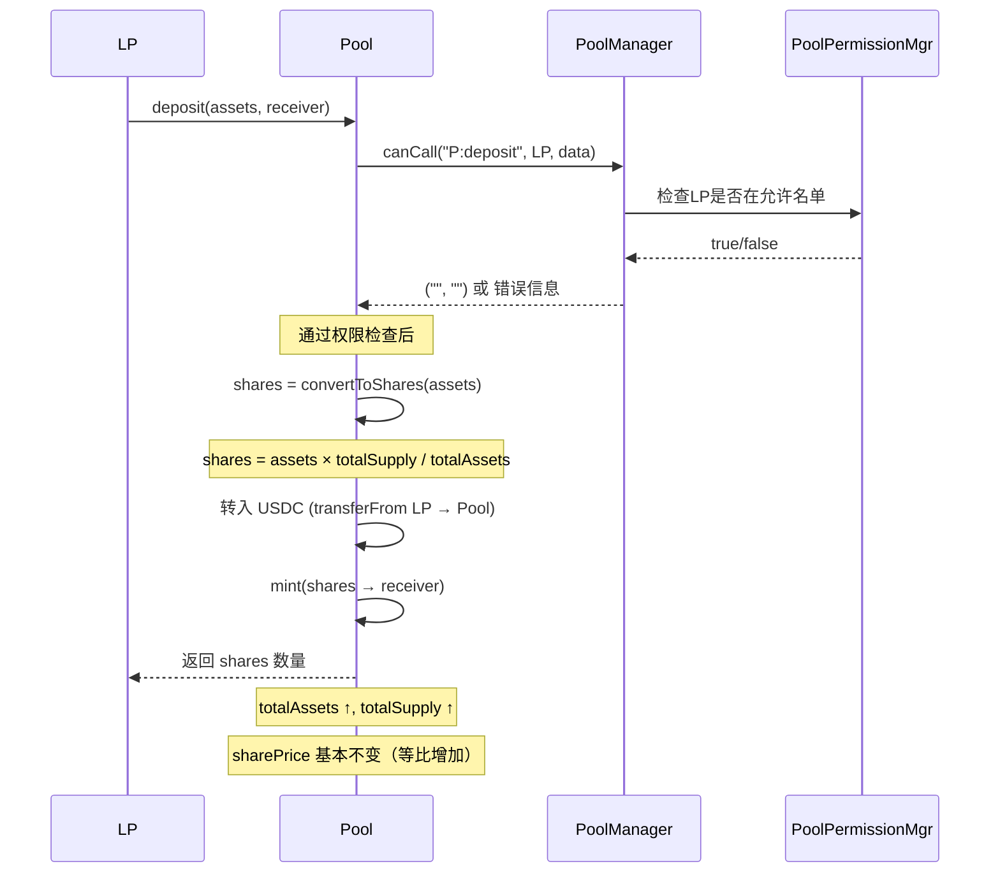
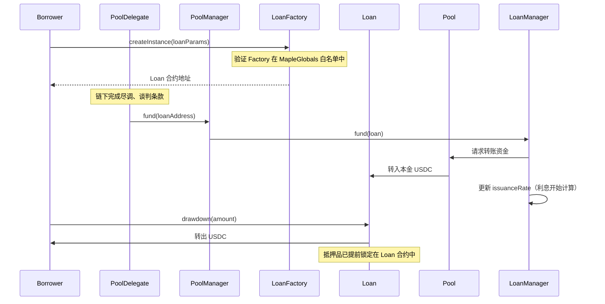
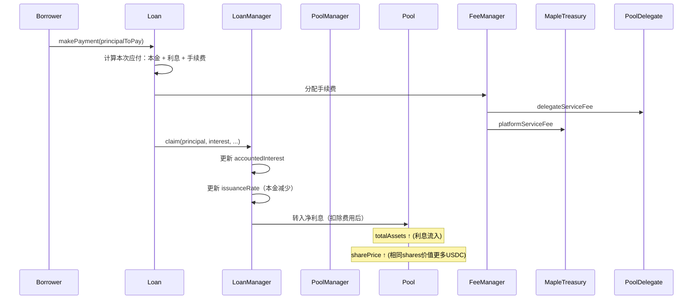
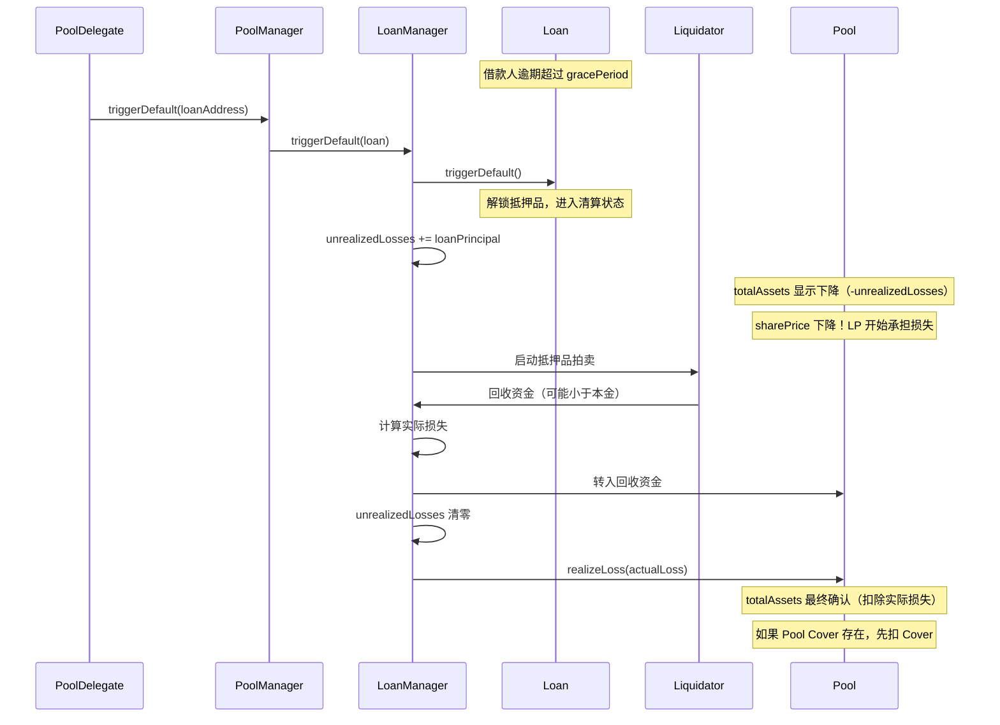
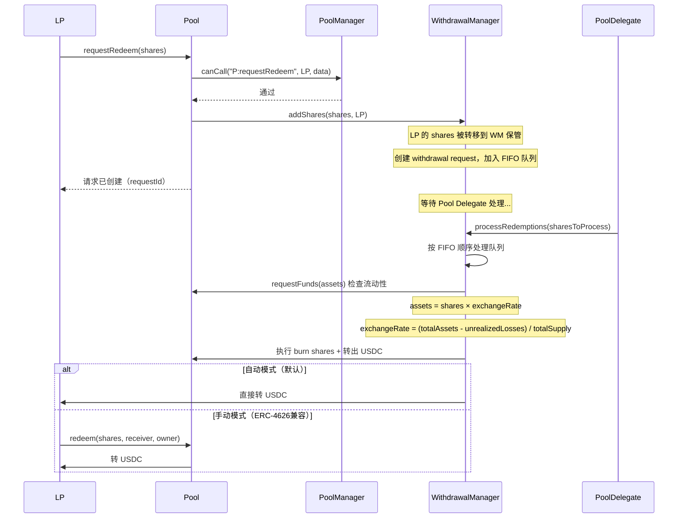

# Maple Finance Core V2 — 合约代码深度解析

> 面向想深入理解 DeFi 借贷合约架构的开发者/研究者
> 基于 Maple Finance V2 官方文档 + 源码分析

---

## 目录

1. [整体架构图](#1-整体架构图)
2. [核心合约职责说明](#2-核心合约职责说明)
3. [角色系统](#3-角色系统)
4. [用户旅程：完整流程拆解](#4-用户旅程完整流程拆解)
   - 4.1 LP 存款
   - 4.2 Delegate 发放贷款
   - 4.3 借款人还款
   - 4.4 违约与清算
   - 4.5 LP 赎回
5. [关键设计模式解析](#5-关键设计模式解析)
   - 5.1 ERC-4626 Vault 标准
   - 5.2 工厂模式（Factory Pattern）
   - 5.3 角色权限分层（Access Control）
   - 5.4 会计模型（Accounting）
6. [核心函数伪代码注释](#6-核心函数伪代码注释)
7. [Maple V2 vs Aave V3 深度对比](#7-maple-v2-vs-aave-v3-深度对比)
8. [初学者常见疑问解答](#8-初学者常见疑问解答)
9. [学习路径建议](#9-学习路径建议)

---

## 1. 整体架构图

### 1.1 合约关系图

```
┌─────────────────────────────────────────────────────────────────┐
│                        MapleGlobals                             │
│          （协议全局参数中心 / Governor 控制）                       │
└────────────────────────┬────────────────────────────────────────┘
                         │ 读取参数 / 验证合约白名单
                         │
┌────────────────────────▼────────────────────────────────────────┐
│                       PoolManager                               │
│        （Pool 的控制面板，Delegate 的操作入口）                     │
│                                                                 │
│  ┌─────────────────┐   ┌───────────────┐   ┌────────────────┐  │
│  │   LoanManager   │   │  Withdrawal   │   │External Strategy│ │
│  │ （贷款会计核算）  │   │   Manager     │   │ （Aave/Sky等）  │  │
│  │                 │   │ （赎回队列）   │   │                │  │
│  └────────┬────────┘   └───────┬───────┘   └────────────────┘  │
└───────────┼────────────────────┼────────────────────────────────┘
            │                    │
            │ 管理/报告           │ 处理赎回
            │                    │
┌───────────▼────────────────────▼────────────────────────────────┐
│                         Pool.sol                                │
│               （ERC-4626 Vault，LP 唯一交互入口）                  │
│                                                                 │
│    deposit() / requestRedeem() / redeem() / mint()              │
└─────────────────────────────────────────────────────────────────┘
            │                    │
            │ 资金流向            │ 资金返回
            ▼                    ▲
┌───────────────────┐   ┌────────────────────┐
│    Loan.sol        │   │    Loan.sol        │
│  （固定期限贷款合约） │   │  （开放期限贷款合约）  │
│                   │   │                    │
│  drawdown()       │   │  makePayment()      │
│  makePayment()    │   │  drawdown()         │
└───────────────────┘   └────────────────────┘
```

### 1.2 角色与合约交互边界

```
  Governor（DAO多签）
       │
       │ 设置全局参数
       ▼
  MapleGlobals ◄──── 验证合约是否在白名单
       │
       │
  Pool Delegate（信用经理）
       │
       ├──► PoolManager.fund()          → 发放贷款
       ├──► PoolManager.triggerDefault() → 触发违约
       ├──► WithdrawalManager.processRedemptions() → 处理赎回队列
       └──► 配置 Pool 参数（流动性上限、费率等）

  LP（流动性提供者）
       │
       ├──► Pool.deposit()         → 存钱
       ├──► Pool.requestRedeem()   → 申请赎回
       └──► Pool.redeem()          → 取钱（满足条件后）

  Borrower（机构借款人，KYC白名单）
       │
       ├──► MapleLoanFactory.createInstance() → 创建贷款合约
       ├──► Loan.drawdown()                   → 提款
       └──► Loan.makePayment()                → 还款+利息
```

---

## 2. 核心合约职责说明

### 2.1 `Pool.sol` — 流动性容器

**职责**：LP 唯一需要交互的合约，是整个协议的"存款账户"。

**核心特点**：
- 实现 **ERC-4626 Tokenized Vault 标准**
- 设计原则是"尽量简单"，复杂逻辑委托给 `PoolManager`
- **不可升级**（immutable），通过 PoolManager 扩展功能

**核心存储**：
```
totalAssets = 池子里所有资产的总价值
             （包括：可用USDC + 已出借的本金 + 应计利息 - 未实现损失）

totalSupply = LP shares 总量

sharePrice  = totalAssets / totalSupply  （每个share价值多少USDC）
```

**权限门控（Call Gating）**：
所有状态修改函数都通过 `checkCall` 修饰器，委托给 `PoolManager.canCall()` 验证。这意味着 Pool 合约本身不存储权限逻辑，而是向上委托。

```solidity
modifier checkCall(bytes32 functionId_) {
    // 委托给 PoolManager 验证调用者权限
    ( , string memory errorMessage_) = poolManager.canCall(
        functionId_, msg.sender, msg.data[4:]
    );
    require(errorMessage.length == 0, errorMessage);
    _;
}
```

---

### 2.2 `PoolManager.sol` — Delegate 控制面板

**职责**：Pool 的"大脑"，持有几乎所有的管理功能，是 Pool 与外部世界（Loan、Strategy、WithdrawalManager）之间的中间层。

**Pool 与 PoolManager 是 1:1 关系** — 一个 Pool 对应一个 PoolManager。

**核心功能**：
| 功能 | 调用方 | 说明 |
|------|--------|------|
| `fund(loan)` | Pool Delegate | 用 Pool 资金发放贷款 |
| `triggerDefault(loan)` | Pool Delegate | 触发违约处理 |
| `addStrategy(loanManager)` | Pool Delegate | 添加收益策略 |
| `setLiquidityCap(amount)` | Pool Delegate | 设置存款上限 |
| `canCall(funcId, caller, data)` | Pool | 权限检查路由 |
| `processRedeem(shares, owner)` | WithdrawalManager | 处理赎回资金转移 |

---

### 2.3 `LoanManager.sol` — 贷款会计核算

**职责**：跟踪所有未偿还贷款的会计记录，计算应计利息，报告给 Pool 的 `totalAssets`。

**为什么单独抽出来？**

> 因为会计逻辑可能需要变化，但 Pool 合约是不可升级的。
> 独立的 LoanManager 可以更换，而不需要迁移 LP shares。

Maple 有两种 LoanManager：
- **FixedTermLoanManager** — 管理固定期限贷款（有明确到期日）
- **OpenTermLoanManager** — 管理开放期限贷款（可随时提前还款）

**核心会计变量**：
```
issuanceRate     = 每秒应计利息速率（所有活跃贷款的总和）
accountedInterest = 已经记账的利息
domainStart      = 最近一次利息计算的时间戳
domainEnd        = 下一次必须更新会计的时间点（最近贷款到期日）
unrealizedLosses = 已宣布违约但尚未处理的损失额
```

**利息累积公式**：
```
accruedInterest(t) = issuanceRate × (t - domainStart)
totalAssets(t)     = poolCash + principalOut + accountedInterest + accruedInterest(t) - unrealizedLosses
```

---

### 2.4 `Loan.sol` (MapleLoan) — 单笔贷款合约

**职责**：代表借款人与贷款方之间的借贷协议，包含所有条款、还款计划、违约条件。

**关键设计**：每笔贷款都是一个**独立的合约实例**（而不是 mapping 中的一条记录）。

有两种类型：
- **FixedTermLoan** — 固定期限、固定利率、按期还款
- **OpenTermLoan** — 无固定到期日，可提前还款，利息按天计算

**固定期限贷款的关键参数**：
```
principal       = 借款本金
interestRate    = 年化利率（基点单位）
paymentInterval = 还款间隔（秒）
paymentsRemaining = 剩余还款次数
gracePeriod     = 宽限期（逾期后多少秒才能触发违约）
collateral      = 抵押品地址和金额
```

---

### 2.5 `WithdrawalManager.sol` — 赎回队列管理

**职责**：管理 LP 退出请求，以公平有序的方式处理赎回，防止挤兑。

**核心机制（FIFO 队列）**：
- LP 先调用 `requestRedeem()` → 进入队列，shares 被锁定
- Pool Delegate 调用 `processRedemptions()` → 按队列顺序处理
- 流动性不足时，只处理队列前面的请求，后面的继续等待

**汇率计算**：
```
exchangeRate = (totalAssets - unrealizedLosses) / totalSupply
assets = shares × exchangeRate
```

注意：如果在贷款违约/清算期间赎回，`unrealizedLosses` 会扣减 `totalAssets`，导致每个 share 价值更低。

---

### 2.6 `MapleGlobals.sol` — 协议全局参数中心

**职责**：存储所有协议级别的参数，是 Governor（DAO）控制协议的主入口。

**存储内容**：
- 合约工厂白名单（防止恶意合约被接入）
- 协议费率（origination fee rate、service fee rate）
- 各 Pool 允许的借款人地址
- 紧急暂停开关

---

## 3. 角色系统

```
角色层级（权力从高到低）：

Governor (GovernorTimelock)
  ├── 修改全局参数（MapleGlobals）
  ├── 管理合约工厂白名单
  ├── 时间锁控制智能合约升级
  └── 所有参数变更有延迟执行窗口

Security Admin
  └── 紧急暂停协议（只用于安全事故响应）

Operational Admin
  └── 日常运营操作子集（权限小于 Governor）

Pool Delegate（每个 Pool 有独立的 Delegate）
  ├── 审批借款人白名单
  ├── 发放 / 再融资 / 违约处理贷款
  ├── 配置 Pool 参数（流动性上限、费率）
  ├── 处理赎回队列
  └── 质押自己的 MPL/SYRUP 作为信誉背书

Liquidity Provider (LP)
  ├── deposit() — 存款
  ├── requestRedeem() — 申请赎回
  └── redeem() — 取款（队列处理后）

Borrower（KYC白名单机构）
  ├── createLoan() — 创建贷款合约
  ├── drawdown() — 提款
  ├── makePayment() — 还款
  └── closeLoan() — 提前还清
```

---

## 4. 用户旅程：完整流程拆解

### 4.1 旅程 A：LP 存款流程



**关键理解**：
- `shares` 不是 1:1 换 USDC，而是按当前 `sharePrice` 换算
- 早期存入 sharePrice = 1.0 USDC，随利息累积 sharePrice 会涨到 1.05、1.1...
- 相同 USDC，后期存入拿到的 shares 更少

---

### 4.2 旅程 B：Delegate 发放贷款



**关键理解**：
- Loan 合约由借款人创建（不是 Delegate），但 Delegate 决定要不要 fund
- `fund()` 之后利息就开始线性累积（`issuanceRate` 更新）
- `drawdown()` 时可能扣除 origination fee

---

### 4.3 旅程 C：借款人还款



**费用分配结构**：
```
borrower 支付的总利息
  ├── delegateServiceFee → Pool Delegate 钱包
  ├── platformServiceFee → Maple Treasury
  └── 净利息 → Pool（LP 受益）
```

---

### 4.4 旅程 D：违约与清算



**损失传导链**：
```
贷款违约
  → Loan 抵押品清算（能回收多少算多少）
  → 若回收 < 本金：Pool Cover 首先承担损失
  → 若损失 > Pool Cover：剩余损失由 LP 按比例承担
  → LP shares 价格永久性下降
```

---

### 4.5 旅程 E：LP 赎回（重点难点）



**为什么不能即时赎回？**

> 因为大部分资金都在 Loan 合约里（已出借），Pool 里的"现金"只是未出借的部分。
> 如果允许即时赎回，少数人提走现金后，后来的人什么都拿不到（挤兑）。

**FIFO 队列的公平性**：
- 先提申请的先得到处理
- 流动性不足时，只有队列前面的人拿到钱
- 后面的人继续等，不会被"插队"
- 最后一个被处理的请求可能被部分赎回（partial redemption）

---

## 5. 关键设计模式解析

### 5.1 ERC-4626 Vault 标准

ERC-4626 是以太坊的"代币化金库"标准，定义了一套统一接口，让所有金库（借贷池、收益策略等）都可以互相组合。

**核心接口**：
```solidity
// 存款：用资产换 shares
function deposit(uint256 assets, address receiver) returns (uint256 shares)
function mint(uint256 shares, address receiver) returns (uint256 assets)

// 赎回：用 shares 换资产
function withdraw(uint256 assets, address receiver, address owner) returns (uint256 shares)
function redeem(uint256 shares, address receiver, address owner) returns (uint256 assets)

// 换算函数
function convertToShares(uint256 assets) returns (uint256 shares)
function convertToAssets(uint256 shares) returns (uint256 assets)
```

**shares 价格如何变化**：

```
初始状态：totalAssets = 1,000,000 USDC, totalSupply = 1,000,000 shares
         sharePrice = 1.0 USDC/share

月后利息进入：totalAssets = 1,050,000 USDC, totalSupply = 1,000,000 shares
             sharePrice = 1.05 USDC/share  ← 升值了！

发生违约：totalAssets = 950,000 USDC, totalSupply = 1,000,000 shares
          sharePrice = 0.95 USDC/share  ← 亏损了！
```

**Maple 对 ERC-4626 的修改**：
1. `requestRedeem()` 必须先于 `redeem()` 调用（两步走）
2. 不鼓励使用 `withdraw()`（因为 share 价格每个区块都在变化，容易导致数量不匹配）
3. 使用 `checkCall` 修饰器做权限门控（ERC-4626 原标准没有权限控制）

---

### 5.2 工厂模式（Factory Pattern）

**为什么用工厂模式？**

Maple 协议中会存在成百上千个 Loan 合约实例，每个实例都需要：
- 被部署到链上
- 被协议验证"是合法的 Maple Loan"（防止攻击者用恶意合约假冒）
- 被统一升级管理

**工厂合约的角色**：
```
MapleLoanFactory
  ├── createInstance(params) → 部署新的 Loan 合约
  ├── 在 MapleGlobals 的白名单中注册
  └── 管理 Loan 合约的升级版本（版本控制）

使用场景：
  LoanManager.fund(loanAddress) 时会验证：
  MapleGlobals.isLoanFactory(loan.factory()) == true
  
  → 确保只有通过正规工厂创建的 Loan 才能被资助
  → 防止攻击者伪造一个"假 Loan 合约"骗走 Pool 的钱
```

**每笔贷款是独立合约 vs Aave 的 mapping**：

| | Maple：独立合约 | Aave：状态映射 |
|--|--|--|
| 灵活性 | 每笔贷款参数完全定制 | 同一资产共享参数 |
| Gas 成本 | 部署合约成本高 | 只写 storage，成本低 |
| 可组合性 | 每个 Loan 可以有不同逻辑 | 逻辑统一 |
| 适用场景 | 机构定制条款 | 标准化零售借贷 |

---

### 5.3 角色权限分层（Access Control）

**Maple 的权限是组合型的**，不是简单的 `onlyOwner`：

```solidity
// PoolManager 中的典型权限控制
modifier onlyPoolDelegate() {
    require(msg.sender == poolDelegate, "PM:NOT_PD");
    _;
}

modifier onlyPoolDelegateOrGovernor() {
    require(
        msg.sender == poolDelegate || 
        msg.sender == IMapleGlobals(globals).governor(),
        "PM:NOT_PD_OR_GOV"
    );
    _;
}

// Loan 中的权限
modifier onlyBorrower() {
    require(msg.sender == borrower, "ML:NOT_BORROWER");
    _;
}

modifier onlyLender() {
    require(msg.sender == lender, "ML:NOT_LENDER");  // lender = LoanManager
    _;
}
```

**权限隔离设计意图**：
- Governor 管全局，不管具体 Pool 业务
- Pool Delegate 管自己 Pool 的业务，不能影响其他 Pool
- LP 只能操作自己的 shares
- Borrower 只能操作自己的 Loan

**与 Aave 对比**：
- Aave：没有 Delegate 角色，合约本身就是"决策者"（算法决定一切）
- Maple：合约是"执行者"，人（Pool Delegate）是"决策者"

---

### 5.4 会计模型（Accounting）

这是 Maple 中最精妙也最难理解的部分。

**问题**：利息每秒都在累积，但不可能每秒都更新链上状态（Gas 太贵）。

**解决方案**：懒惰计算（Lazy Evaluation）

```
issuanceRate = Σ(每笔贷款的每秒利息)
             = 贷款1利率 + 贷款2利率 + ... + 贷款N利率

实时利息 = issuanceRate × (当前时间 - domainStart)
```

只在以下事件触发时更新状态：
- 新贷款发放（`fund()`）
- 还款到来（`makePayment()`）
- 贷款到期（`domainEnd` 到达）
- 违约触发（`triggerDefault()`）

**domainEnd 的含义**：

```
domainEnd = 所有活跃贷款中，最近的到期日

为什么需要这个？
假设：
  贷款A：1月1日到期，每秒利息 = 0.001 USDC
  贷款B：3月1日到期，每秒利息 = 0.002 USDC

domainEnd = 1月1日（最近到期）
issuanceRate = 0.003 USDC/秒

1月1日之后，贷款A结束：
  新 domainStart = 1月1日
  新 domainEnd = 3月1日
  新 issuanceRate = 0.002 USDC/秒（只剩贷款B）
```

**unrealizedLosses 机制**：

```
当 triggerDefault() 被调用：
  unrealizedLosses += 违约贷款的本金（暂时标记为"可能损失"）
  totalAssets 计算时减去 unrealizedLosses
  → sharePrice 立即下降，反映潜在损失

清算完成后：
  unrealizedLosses 清零
  realizeLoss(actualLoss) 确认实际损失
  
目的：清算过程中如果有人赎回，他们承担一部分潜在损失
      不能等清算完才反映损失（对剩余LP不公平）
```

---

## 6. 核心函数伪代码注释

### 6.1 `Pool.deposit()`

```solidity
function deposit(uint256 assets, address receiver) 
    external 
    checkCall("P:deposit")  // 检查LP是否在允许名单
    returns (uint256 shares) 
{
    // 1. 计算能拿到多少 shares
    //    shares = assets * totalSupply / totalAssets
    //    如果 sharePrice = 1.05，存入 105 USDC 只能得到 100 shares
    shares = convertToShares(assets);
    
    // 2. 检查存款后是否超过流动性上限
    require(totalAssets() + assets <= liquidityCap);
    
    // 3. 把 USDC 从 LP 转入 Pool
    asset.safeTransferFrom(msg.sender, address(this), assets);
    
    // 4. mint shares 给 receiver
    _mint(receiver, shares);
    
    emit Deposit(msg.sender, receiver, assets, shares);
}
```

### 6.2 `Pool.requestRedeem()` + `Pool.redeem()`

```solidity
// 第一步：申请赎回
function requestRedeem(uint256 shares, address owner)
    external
    checkCall("P:requestRedeem")
    returns (uint256 escrowedShares)
{
    // 1. 验证调用者是 owner 或被授权
    require(msg.sender == owner || allowance[owner][msg.sender] >= shares);
    
    // 2. 把 shares 转移到 WithdrawalManager 保管
    //    LP 暂时失去 shares 的控制权
    _transfer(owner, address(withdrawalManager), shares);
    
    // 3. 在 WithdrawalManager 中创建赎回请求，进入 FIFO 队列
    escrowedShares = IWithdrawalManager(withdrawalManager)
        .addShares(shares, owner);
}

// 第二步：实际赎回（手动模式才需要）
function redeem(uint256 shares, address receiver, address owner)
    external
    checkCall("P:redeem")
    returns (uint256 assets)
{
    // 1. 验证 WithdrawalManager 已经处理了这个请求
    // 2. 按当前 exchangeRate 计算 assets
    assets = convertToAssets(shares);
    
    // 3. burn shares
    _burn(address(withdrawalManager), shares);
    
    // 4. 转出 USDC 给 receiver
    asset.safeTransfer(receiver, assets);
}
```

### 6.3 `PoolManager.fund()`

```solidity
function fund(address loanAddress) 
    external 
    onlyPoolDelegate 
{
    // 1. 验证 Loan 合约是通过合法工厂创建的
    require(
        IMapleGlobals(globals).isLoanFactory(
            ILoan(loanAddress).factory()
        ),
        "PM:F:INVALID_LOAN_FACTORY"
    );
    
    // 2. 验证借款人在该 Pool 的白名单中
    require(
        IMapleGlobals(globals).isBorrower(loanAddress.borrower()),
        "PM:F:INVALID_BORROWER"
    );
    
    // 3. 委托 LoanManager 执行资金转移和会计更新
    ILoanManager(loanManager).fund(loanAddress);
    
    // 内部：
    // - Pool 转 USDC → Loan 合约
    // - LoanManager 更新 issuanceRate（新贷款的利息开始计入）
    // - LoanManager 更新 domainEnd（如果新贷款到期日更近）
    // - totalAssets 不变（USDC 变成了应收本金）
}
```

### 6.4 `LoanManager.claim()` — 利息结算

```solidity
// 当借款人还款时，Loan 合约调用这个函数结算利息
function claim(
    uint256 principal,
    uint256 interest,
    uint256 previousPaymentDueDate,
    uint256 nextPaymentDueDate
) external onlyLoan {
    // 1. 更新会计：把"应计但未实现"的利息变成"已实现"
    _updateIssuanceParams(currentTime);
    
    // 2. 处理本金：本金还回来了，principalOut 减少
    if (principal > 0) {
        principalOut -= principal;
        // 把本金转回 Pool
        pool.safeTransfer(principal);
    }
    
    // 3. 处理利息：分配给各方
    // interest → FeeManager（分配给 Delegate 和 Treasury）
    // net interest → Pool（LP 收益）
    uint256 netInterest = _distributeInterest(interest);
    
    // 4. 更新下一个 domainEnd
    _updateDomainEnd(nextPaymentDueDate);
    
    // totalAssets 净增加 = netInterest（扣除费用后）
}
```

### 6.5 `PoolManager.triggerDefault()`

```solidity
function triggerDefault(address loanAddress)
    external
    onlyPoolDelegate
{
    // 1. 验证贷款确实逾期了
    require(
        ILoan(loanAddress).isInDefault(),
        "PM:TD:NOT_IN_DEFAULT"
    );
    
    // 2. 委托 LoanManager 处理违约
    (uint256 remainingLosses, uint256 unrecoveredLosses) = 
        ILoanManager(loanManager).triggerDefault(loanAddress);
    
    // 内部执行：
    // - unrealizedLosses += loanPrincipal（标记潜在损失）
    // - 启动抵押品清算流程
    // - 清算完成后：unrealizedLosses 清零，realizeLoss 确认实际损失
    
    // 3. 处理 Pool Cover（如果有）
    if (poolCover > 0) {
        _handleCoverPayment(remainingLosses);
    }
}
```

---

## 7. Maple V2 vs Aave V3 深度对比

| 维度 | Aave V3 | Maple V2 |
|------|---------|----------|
| **设计哲学** | 无许可自动机 | 有许可管理机 |
| **利率模型** | 算法自动（供需曲线，每块更新） | 人工谈判固定利率 |
| **清算触发** | 任何人无许可调用（机器人竞争） | 仅 Pool Delegate 调用 |
| **借款人准入** | 任何钱包，无需 KYC | KYC 白名单机构 |
| **抵押要求** | 超额抵押（LTV 50-80%） | 轻抵押或特定资产抵押 |
| **存款凭证** | aToken（rebase，余额实时增加） | ERC-4626 shares（价格增加） |
| **赎回机制** | 即时（有流动性时）| 排队 FIFO 队列 |
| **每笔贷款** | 状态映射（mapping in Pool） | 独立合约实例 |
| **利率更新** | 每笔交易实时更新 | 懒惰计算（issuanceRate × time） |
| **风控主体** | 合约数学（Health Factor） | Pool Delegate + 合约 |
| **协议收入** | 利差百分比 | origination fee + management fee |
| **代码复杂度重心** | 数学模型（利率曲线、清算激励） | 角色权限管理 |
| **Gas 效率** | 高（mapping，无需部署新合约） | 低（每笔贷款部署新合约） |
| **适合场景** | 标准化零售借贷 | 定制化机构信贷 |

**一句话总结**：
- Aave = 自动贩卖机（规则写在合约里，公开透明，任何人参与）
- Maple = 私人银行窗口（人在做决策，合约只是执行工具）

---

## 8. 初学者常见疑问解答

### Q1：为什么 shares 价格会变化？

因为 `sharePrice = totalAssets / totalSupply`。

- `totalSupply` 只在 mint/burn 时变化（存款/赎回时）
- `totalAssets` 每秒都在因为利息而增加
- 所以即使你不操作，你持有的 shares 价值每秒都在增加

这就是 ERC-4626 的核心魔法：用"价格变化"代替"余额变化"来表示收益。

### Q2：LP 亏损是怎么发生的？

```
正常：totalAssets 随利息增加 → sharePrice ↑ → LP赚钱

违约：
  1. triggerDefault() → unrealizedLosses ↑ → totalAssets计算时 ↓ → sharePrice ↓
  2. 清算完成 → realizeLoss(actualLoss) → totalAssets永久 ↓ → sharePrice永久 ↓
  3. 结果：LP拿到的USDC比存入的少（亏损）
```

### Q3：Pool Cover 是什么？谁提供？

Pool Cover 是 Pool Delegate 用来保护 LP 的"安全垫"：
- Delegate 自己质押 MPL/SYRUP token 作为 Cover
- 当发生违约损失时，先扣 Cover，LP 是最后承担损失的
- 目的：让 Delegate 有"切肤之痛"（skin in the game），激励其认真尽调

### Q4：Delegate 质押的 token 如何被 slash？

```
违约发生：
  remainingLoss = 实际损失金额
  
  if (remainingLoss > 0 && poolCover > 0):
      slashAmount = min(remainingLoss, poolCover)
      delegate_cover_balance -= slashAmount
      remainingLoss -= slashAmount
  
  if (remainingLoss > 0):
      LP 承担剩余损失（totalAssets 减少）
```

质押的 token 按 USDC 计价换算，不足以覆盖损失时 LP 才开始亏损。

### Q5：为什么每笔贷款是独立合约，而不是 Aave 那样的 mapping？

| 方案 | 优点 | 缺点 |
|------|------|------|
| 独立合约（Maple） | 每笔贷款有独立逻辑、定制参数、可单独升级 | Gas贵，合约数量多 |
| Mapping（Aave） | Gas 便宜，简单高效 | 所有借款共享同一套逻辑 |

对于机构贷款，每笔合约金额大（百万美元级），定制化要求高，独立合约的灵活性完全值得更高的 Gas 成本。

### Q6：什么是 domainStart 和 domainEnd？

这是 Maple 利息"懒惰计算"的时间窗口：

```
domainStart: 上次更新会计的时间点
domainEnd:   下次必须更新会计的时间点（最近到期的贷款日期）

在 [domainStart, domainEnd] 区间内：
  accrued_interest = issuanceRate × (now - domainStart)
  
过了 domainEnd 之后：
  - issuanceRate 可能需要更新（有贷款到期）
  - 必须先调用更新函数，才能继续计算
```

---

## 9. 学习路径建议

如果你想深入阅读 Maple 代码，推荐按以下顺序：

```
第1步：理解 ERC-4626 标准
  → 读 EIP-4626 原文（10分钟）
  → 理解 shares/assets 换算

第2步：读 Pool.sol
  → 重点：deposit(), requestRedeem(), redeem()
  → 关注 checkCall 修饰器的作用
  GitHub: maple-labs/pool-v2

第3步：读 PoolManager.sol
  → 重点：fund(), triggerDefault(), canCall()
  → 理解 Delegate 权限边界
  GitHub: maple-labs/pool-v2

第4步：读 WithdrawalManager.sol
  → 重点：addShares(), processRedemptions()
  → 理解 FIFO 队列机制
  GitHub: maple-labs/withdrawal-manager-v2

第5步：读 FixedTermLoan.sol
  → 重点：drawdown(), makePayment()
  → 理解还款计划和违约条件
  GitHub: maple-labs/fixed-term-loan-manager

第6步：读 FixedTermLoanManager.sol
  → 重点：fund(), claim(), triggerDefault()
  → 理解 issuanceRate 会计模型
  GitHub: maple-labs/fixed-term-loan-manager
```

---

*文档基于 Maple Finance V2 官方文档和源码，版本时间：2026 Q1*
*仓库：https://github.com/Jx0nathan/rwa-research*
