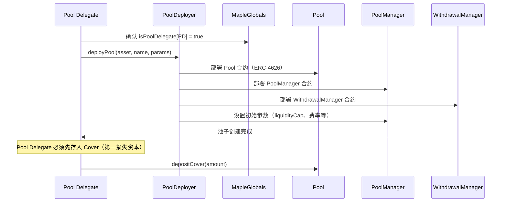
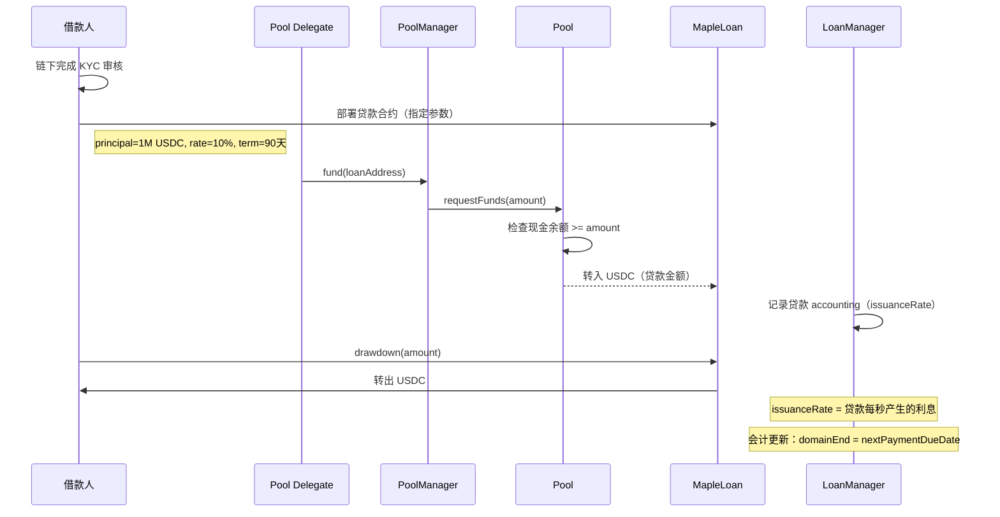
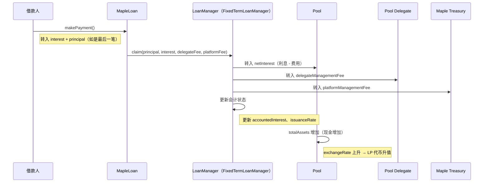
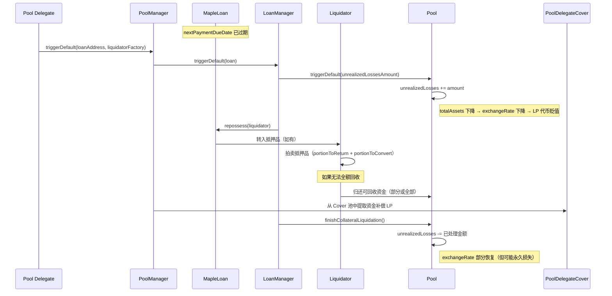
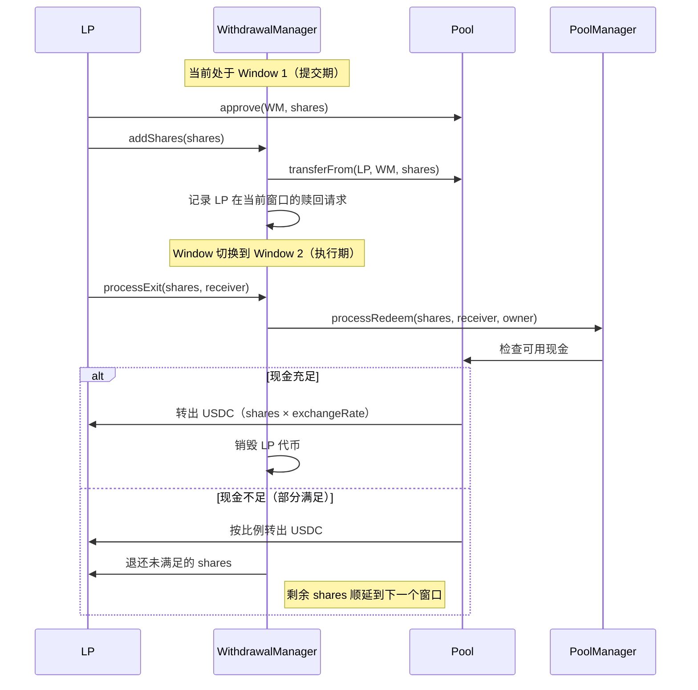

# Maple Finance 深度解析

> 版本：Maple V2（maple-core-v2）  
> 网络：Ethereum Mainnet + Base  
> 调研时间：2026-03-23  
> GitHub：https://github.com/maple-labs/maple-core-v2

---

## 一、读前必知

**这份文档要回答三个问题：**
1. Maple 在做什么生意？钱怎么进来、怎么出去、怎么赚钱？
2. 合约怎么设计的？每个合约负责什么？
3. 关键流程的代码逻辑是什么？有哪些陷阱？

---

## 二、业务模式

### 2.1 一句话定位

**链上机构信贷市场：** Pool Delegate（信贷经理）创建资金池，审核借款人资质，向机构借款人发放贷款；LP（流动性提供者）存入资金赚取利息；Maple 协议收取管理费。

类比传统金融：Maple = 私募信贷基金平台（Private Credit Fund Platform）

### 2.2 核心角色

```
┌──────────────────────────────────────────────────────────┐
│                    Maple 生态                             │
│                                                           │
│  ┌──────────┐    ┌──────────────┐    ┌────────────────┐  │
│  │    LP    │    │ Pool Delegate│    │    Borrower    │  │
│  │(流动性   │    │(信贷经理)    │    │(机构借款人)    │  │
│  │ 提供者)  │    │              │    │                │  │
│  └────┬─────┘    └──────┬───────┘    └───────┬────────┘  │
│       │存入USDC          │管理池子             │借款       │
│       │                 │                    │还款       │
│       ▼                 ▼                    ▼           │
│  ┌────────────────────────────────────────────────────┐  │
│  │                    Pool（资金池）                    │  │
│  └────────────────────────────────────────────────────┘  │
│                                                           │
│  Maple 协议：收取管理费（originationFee + servicingFee）  │
└──────────────────────────────────────────────────────────┘
```

| 角色 | 职责 | 激励 |
|---|---|---|
| **LP** | 存入 USDC 等稳定币，获得 LP 代币 | 贷款利息收益（扣除费用后） |
| **Pool Delegate** | 审核借款人、发放贷款、管理风险 | 分成贷款利息（delegateManagementFee） |
| **Borrower（借款人）** | KYC 后申请贷款，抵押（或信用）借款 | 获得链上资金 |
| **Maple 协议** | 提供基础设施 | 收取 originationFee + platformManagementFee |

### 2.3 两种贷款产品

| 类型 | Fixed Term Loan | Open Term Loan |
|---|---|---|
| 期限 | 固定（如 90 天、180 天） | 无固定到期日 |
| 还款方式 | 到期还本，按期付息（或摊还） | 随时还款，随时借款 |
| 适合场景 | 项目融资、贸易融资 | 循环信贷额度 |
| 链上合约 | `MapleLoan.sol` | `MapleOpenTermLoan.sol` |
| 管理合约 | `FixedTermLoanManager.sol` | `OpenTermLoanManager.sol` |

### 2.4 收费结构

```
借款人支付的总利息 = 贷款本金 × 年化利率 × 期限

利息分配：
  ├── Pool Delegate Management Fee（信贷经理分成，约 10-20%）
  ├── Platform Management Fee（Maple 协议费，约 0-5%）
  └── LP 实际收益（剩余部分）

其他费用：
  Origination Fee（发起费）= 贷款金额 × 固定比例（约 0.25-1%）
    ├── Delegate Origination Fee → Pool Delegate
    └── Platform Origination Fee → Maple Treasury
```

---

## 三、合约架构

### 3.1 整体架构图

```
┌─────────────────────────────────────────────────────────────────┐
│                      MapleGlobals（全局配置）                     │
│  - 协议管理员（Governor）                                         │
│  - 白名单（合法资产、合法合约）                                    │
│  - 全局费率设置                                                   │
└──────────────────────────────┬──────────────────────────────────┘
                               │ 全局参数读取
              ┌────────────────┼────────────────────┐
              │                │                    │
┌─────────────▼──────┐ ┌───────▼────────┐ ┌────────▼────────────┐
│   PoolDeployer     │ │  PoolManager   │ │   WithdrawalManager  │
│  （工厂合约）       │ │ （池子管理）   │ │  （提款管理）         │
│  部署新的资金池     │ │ - 发放贷款     │ │  - Cyclical（周期制）│
└────────────────────┘ │ - 管理参数     │ │  - Queue（队列制）   │
                       │ - 处理违约     │ └─────────────────────┘
                       └───────┬────────┘
                               │管理
              ┌────────────────┼─────────────────┐
              │                │                 │
┌─────────────▼──────┐ ┌───────▼────────┐ ┌─────▼──────────────┐
│   Pool（ERC-4626）  │ │  MapleLoan     │ │  PoolDelegateCover  │
│  - LP 存款代币      │ │ （贷款合约）   │ │  （第一损失资本）    │
│  - 核心会计逻辑     │ │ - Fixed Term   │ └────────────────────┘
│  - 汇率计算         │ │ - Open Term    │
└────────────────────┘ └───────┬────────┘
                               │
                    ┌──────────▼──────────┐
                    │      Liquidator     │
                    │  （违约清算拍卖）   │
                    └─────────────────────┘
```

### 3.2 核心合约职责详解

#### MapleGlobals（全局配置中心）
```solidity
// 关键存储：
address public governor;           // 协议管理员
mapping(address => bool) public isPoolAsset;      // 合法的资产（USDC等）
mapping(address => bool) public isPoolDelegate;   // 合法的信贷经理
uint256 public platformManagementFeeRate;         // 平台管理费率
uint256 public maxCoverLiquidationPercent;        // 最大Cover清算比例

// 关键作用：
// 任何合约在执行关键操作前，都要先查 MapleGlobals 做合规校验
// 这是整个协议的「权限中枢」
```

#### Pool（核心 ERC-4626 代币合约）
```
职责：
  - 接收 LP 存款，铸造 LP 代币（shares）
  - 计算并维护汇率（totalAssets / totalSupply）
  - 向 LoanManager 调度资金

关键计算：
  totalAssets = cash（现金）+ unrealizedLosses 之外的贷款价值
  exchangeRate = totalAssets / totalShares
  
  存入 100 USDC，铸造的 shares 数量 = 100 / exchangeRate
  赎回 shares，得到的 USDC = shares × exchangeRate
```

#### PoolManager（资金池操作层）
```
职责：
  - Pool Delegate 通过此合约操作资金池
  - 发放贷款：fund(loanAddress)
  - 设置池子参数：liquidityCap、delegateManagementFeeRate 等
  - 触发违约处理：triggerDefault(loan)
  - 接收贷款还款，分配给 Pool
```

#### MapleLoan（贷款合约）
```
每一笔贷款 = 一个独立的 MapleLoan 合约实例（工厂模式创建）

关键状态：
  - principal：贷款本金
  - interestRate：年化利率
  - collateralRequired：抵押品数量
  - nextPaymentDueDate：下次还款截止日
  - refinanceCommitment：再融资提案哈希

Fixed Term Loan 还款周期：
  payment = principal × interestRate × days / 365
  到期还本 + 按期付息（或摊还）
```

#### WithdrawalManager（提款管理）

两种模式：

**模式 A：Cyclical（周期制）**
```
时间轴：
  [Window 1: 提交期]  [Window 2: 执行期]  [Window 3: 提交期] ...
  ↑                   ↑                   ↑
  LP 提交赎回请求      LP 执行赎回          LP 提交赎回请求

- 每个 Window 固定时长（如 2 周）
- 提交期：LP 调用 addShares() 锁定 LP 代币
- 执行期：LP 调用 processExit() 领取 USDC
- 现金不够时：按比例分配（pro-rata），剩余顺延到下个窗口
```

**模式 B：Queue（队列制）**
```
- LP 提交请求后进入 FIFO 队列
- 有现金时按顺序满足
- 适合流动性较差的池子
```

---

## 四、核心流程详解

### 4.1 Pool 创建流程




### 4.3 贷款发放流程



### 4.4 还款流程



### 4.5 违约 & 清算流程（最关键）



### 4.6 LP 提款流程（Cyclical 模式）



---

## 五、关键机制深度解析

### 5.1 会计系统：利息如何累积

这是 Maple 最精妙也最复杂的部分。

**核心概念：issuanceRate（发行速率）**

```
每笔贷款有一个 issuanceRate = 每秒产生的利息

举例：
  贷款 100 USDC，年化 10%，90天期
  每日利息 = 100 × 10% / 365 ≈ 0.027 USDC/天
  每秒利息 = 0.027 / 86400 ≈ 3.12e-7 USDC/秒

Pool 总 totalAssets 计算：
  totalAssets = cash
              + Σ(每笔贷款的 principal + 已累积利息)
              - unrealizedLosses
```

**为什么要用 issuanceRate 而不是直接记利息？**

因为利息是连续累积的，不能每秒都触发链上交易更新。
所以设计了懒计算（lazy evaluation）：
- 只在关键操作时（还款、存款、提款）更新 accountedInterest
- 任意时刻 totalAssets = 上次记录值 + (now - lastUpdated) × issuanceRate

```solidity
// 伪代码
function totalAssets() external view returns (uint256) {
    return cash 
        + accountedInterest 
        + (block.timestamp - domainStart) × issuanceRate
        - unrealizedLosses;
}
```

### 5.2 unrealizedLosses 的作用

**unrealizedLosses 是 Maple 风控设计的核心。**

```
时序：
  T0: 贷款发放，一切正常
  T1: 还款到期，借款人违约
  T2: Pool Delegate 触发 triggerDefault()
      → unrealizedLosses += 贷款全额
      → Pool totalAssets 立即下降
      → exchangeRate 立即下降
      → LP 代币价格立即跌落
  T3: 清算进行中...
  T4: 清算完成，回收 60% 资金
      → unrealizedLosses -= 贷款全额
      → Pool 获得 60% 回收款
      → 净损失 40% 永久反映在 exchangeRate 中
```

**设计意图：**
- 违约发生时，立即让 LP 感知损失，不允许"隐藏坏账"
- 防止新 LP 在坏账期间存款，然后快速提款套利

### 5.3 PoolDelegateCover（第一损失资本）

```
Pool Delegate 必须在池子中存入自己的资金（Cover）

作用：
  - 利益对齐：PD 如果乱发贷款，自己先亏钱
  - 损失缓冲：清算后仍有损失时，先从 Cover 里补偿 LP

Cover 提取限制：
  - 只有在池子关闭后才能提取全部
  - 日常运营中提取有上限（maxCoverLiquidationPercent）

典型设置：Cover = 贷款规模的 2-5%
```

### 5.4 代理工厂模式（MapleProxyFactory）

Maple 所有核心合约都用代理工厂部署：

```
MapleProxyFactory
  ├── 存储 implementation 地址（逻辑合约）
  ├── 部署最小代理（EIP-1167 Clone）
  └── 支持合约升级（upgradeToVersion）

优势：
  - 每个 Pool / Loan 是独立合约，互相隔离
  - 升级时只需更新 implementation，不需要迁移数据
  - 节省 Gas（Clone 比完整部署便宜）
```

---

## 六、需要重点注意的风险点

### 6.1 信用风险（最大风险）

```
⚠️ Maple 的贷款大部分是无抵押或低抵押的！

这意味着：
  - 借款人违约 → 没有足够抵押品可清算 → LP 永久损失本金
  - 风控完全依赖 Pool Delegate 的信用审核能力
  
历史案例：
  2022年熊市，多家借款机构（Orthogonal、Auros）违约
  Maple LP 损失约 $70M
  这是 Maple 协议设计中最大的系统性风险
```

### 6.2 Pool Delegate 集中风险

```
⚠️ Pool Delegate 权限极大：
  - 可以向任何地址发放贷款（理论上包括自己控制的地址）
  - 可以设置任意费率（在 Globals 限制范围内）
  - 可以触发/不触发违约处理

缓解措施：
  - MapleGlobals 白名单限制谁能做 Pool Delegate
  - Cover 机制（PD 的资金先亏）
  - 但核心信任依然在 Pool Delegate 本身
```

### 6.3 流动性错配

```
⚠️ 贷款期限（90-180天）vs LP 提款（2周窗口）

如果 LP 大量同时申请赎回：
  - WithdrawalManager 只能按现金余额 pro-rata 分配
  - 贷款未到期无法强制回收本金
  - LP 可能等待多个窗口才能赎回全部资金

关键问题：不是 bank run 问题，是流动性管理问题
Pool Delegate 需要主动管理贷款到期与提款窗口的匹配
```

### 6.4 汇率精度攻击

```
⚠️ ERC-4626 的通病：share 价格操纵

攻击场景：
  1. 极少量初始存款（如 1 wei USDC）
  2. 直接向 Pool 合约转入大量 USDC（不通过 deposit）
  3. Exchange rate 被人为拉高
  4. 后续存款者铸造极少 shares，精度损失严重

Maple 的缓解措施：
  - 通过 PoolDeployer 控制初始存款
  - Pool Delegate 必须先存 Cover 才能激活池子
```

---

## 七、与 Centrifuge 的对比

| 维度 | Maple Finance | Centrifuge |
|---|---|---|
| 抵押类型 | 无抵押/低抵押（信用贷款） | 有实物抵押（发票、贷款） |
| 借款人 | 机构（交易所、做市商） | 中小企业（资产发起方） |
| 风控主体 | Pool Delegate（信贷经理） | Asset Originator + NFT 锚定 |
| 流动性 | Cyclical/Queue 提款窗口 | Epoch 机制 |
| 标准 | ERC-4626 | ERC-7540（异步扩展） |
| 违约处理 | 链上清算 + Cover 补偿 | NFT 折现 + TIN 吸收损失 |
| 主要风险 | 信用风险（借款人违约） | 估值风险（NAV 准确性） |
| 目标用户 | 机构 LP（大额） | DeFi + 机构（中等规模） |

---

## 八、学习路径建议

### 按顺序读这些合约

```
第一步：理解全局
  maple-labs/globals-v2
  → MapleGlobals.sol（搞清楚协议的权限体系）

第二步：理解资金池
  maple-labs/pool-v2
  → Pool.sol（ERC-4626，重点看 totalAssets 计算）
  → PoolManager.sol（重点看 fund()、triggerDefault()）

第三步：理解贷款
  maple-labs/fixed-term-loan
  → MapleLoan.sol（重点看 makePayment()、repossess()）
  maple-labs/fixed-term-loan-manager
  → FixedTermLoanManager.sol（重点看 claim()、triggerDefault()）

第四步：理解提款
  maple-labs/withdrawal-manager-cyclical
  → WithdrawalManager.sol（重点看 addShares()、processExit()）

第五步：理解清算
  maple-labs/liquidations
  → Liquidator.sol（重点看拍卖逻辑）
```

### 关键函数速查

| 操作 | 合约 | 函数 |
|---|---|---|
| LP 存款 | Pool | `deposit(assets, receiver)` |
| LP 请求赎回 | WithdrawalManager | `addShares(shares, owner)` |
| LP 执行赎回 | WithdrawalManager | `processExit(shares, receiver, owner)` |
| 发放贷款 | PoolManager | `fund(loanAddress)` |
| 借款人提款 | MapleLoan | `drawdown(drawdownAmount)` |
| 借款人还款 | MapleLoan | `makePayment()` |
| 触发违约 | PoolManager | `triggerDefault(loan, liquidatorFactory)` |
| 完成清算 | PoolManager | `finishCollateralLiquidation(loan)` |
| 查询 LP 价值 | Pool | `totalAssets()` / `convertToAssets(shares)` |

---

## 九、总结

**Maple 的设计哲学：**

> 用链上透明度（所有贷款、还款、违约都在链上）替代传统私募信贷的信息不对称，但把信用风险判断交给专业的 Pool Delegate，而不是试图用算法替代。

**核心设计权衡：**

| 选择 | 代价 |
|---|---|
| 无抵押贷款 → 更高收益 | 更高违约风险 |
| Pool Delegate 人工审核 → 灵活 | 中心化风险 |
| ERC-4626 兼容 → 可组合 | 精度攻击风险 |
| 周期制提款 → 流动性管理可控 | LP 体验差（不能随时提） |

**如果你要学习的重点：**

1. **会计系统（issuanceRate + accountedInterest）**：理解 Maple 如何在不每秒更新链上状态的情况下，精确计算累积利息

2. **unrealizedLosses 机制**：理解违约如何即时反映到 LP 代币价格

3. **ERC-4626 的 totalAssets()**：理解 LP 代币价格的计算逻辑，以及可能的攻击面

4. **WithdrawalManager 的周期机制**：理解流动性错配如何被系统性地管理，而不是崩溃

---

*参考资料：*
- *GitHub: https://github.com/maple-labs/maple-core-v2*
- *文档: https://docs.maple.finance*
- *审计报告: Trail of Bits, Spearbit, Three Sigma, 0xMacro*
