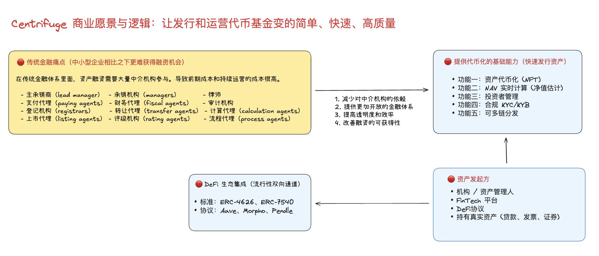
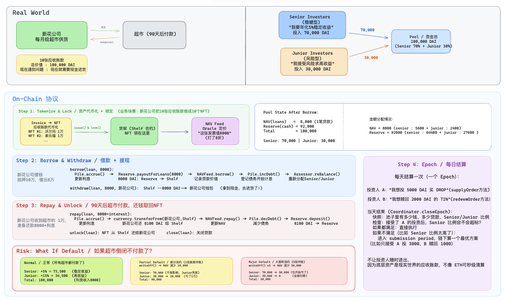

# Centrifuge — 调研笔记

> 官网：https://centrifuge.io
> 文档：https://docs.centrifuge.io

---

## 一句话定位

**DeFi 原生的 RWA 协议层，把真实世界的信贷资产（发票、贷款、ABS）Token 化后接入 MakerDAO/Aave/Morpho，$2B+ TVL，Apollo/Janus Henderson 背书。**

---

## 产品概况

- **TVL：** $2B+（RWA 赛道最大之一）
- **客户：** Apollo Global、Janus Henderson、S&P Dow Jones Indices 等机构
- **DeFi 集成：** Sky（MakerDAO）、Aave Horizon、Morpho、Pendle
- **链：** Centrifuge Chain（自有，基于 Substrate）+ Ethereum + 7 条链
- **Token 标准：** ERC-4626 + ERC-7540（异步赎回）

---

## 核心产品：Centrifuge Pool

**资产发行方（Issuer）视角：**

```
真实世界资产（发票、贷款、ABS、基金份额）
    ↓
创建 Centrifuge Pool
    ↓
资产 Token 化（每笔资产 = 1 个 NFT）
    ↓
NFT 存入 Pool，换取流动性
    ↓
DeFi 用户提供 USDC 流动性
```

**DeFi 用户视角：**

```
存入 USDC
    ↓
获得 Pool Token（Junior / Senior Tranche）
    ↓
赚取比普通 DeFi 更高的固定收益
```



---

## 分级（Tranche）结构

这是 Centrifuge 最重要的技术设计，直接从传统 ABS 借鉴：

```
Senior Tranche（高级）
  → 优先还款，风险最低
  → 收益率：~5-8%
  → 面向机构 / 保守投资者

Junior Tranche（劣后）
  → 最后还款，风险最高（首亏）
  → 收益率：~10-20%
  → 面向高风险偏好 / 发行方自持（信用增强）
```

发行方通常自持 Junior Tranche，作为对 Senior 投资者的信用背书。

---

## ERC-7540：异步赎回的技术解决方案

Centrifuge 主导了 ERC-7540 标准（ERC-4626 的异步扩展），解决了 RWA 的核心流动性问题：

**问题：** RWA 的底层资产不能即时变现（贷款有锁定期、发票有账期），但 DeFi 用户期望随时赎回。

**ERC-7540 方案：**
```
用户发起赎回请求（异步）
    ↓
请求进入队列，等待底层资产到期
    ↓
资产到期后，用户 claim USDC
    ↓
用户等待期间，可以在二级市场出售 pending 状态的 Token
```

这比简单的 T+1 更复杂，但更真实地反映了 RWA 的流动性特征。


```
┌──────────┐  requestRedeem()  ┌────────────┐
│  用户    │ ──────────────►  │  PENDING   │  等待 epoch 处理
└──────────┘                   └─────┬──────┘
                                     │ Centrifuge Chain epoch 完成
                                     ▼
                               ┌────────────┐
                               │ CLAIMABLE  │  shares 已锁定，USDC 可领
                               └─────┬──────┘
                                     │ 用户调 redeem()
                                     ▼
                               ┌────────────┐
                               │  COMPLETE  │  USDC 到账，shares 销毁
                               └────────────┘

取消路径：
PENDING → cancelRedeemRequest() → 等待确认 → 调 withdraw() 领回 shares
```

等待期间用户可在二级市场出售 Tranche Token（如果有流动性），无需等待 epoch。

---

## 业务流程图


---

## NAV的计算逻辑


---

## 竞争定位

Centrifuge 和 Ondo 是**完全不同的赛道**：

- Ondo → 标准化、流动性高的公开市场资产（美债、美股）
- Centrifuge → 非标准化、流动性低的私人信贷资产（发票、贷款、ABS）

两者的 DeFi 集成路径也不同：
- Ondo → Token 直接作为抵押品（高流动性）
- Centrifuge → Pool 提供 Senior/Junior Tranche，通过分级承担信用风险

---

## 关键数据（2025 年）

- 处理资产总额：$2B+
- 活跃 Pool 数量：60+
- 最大 Pool：Blocktower（信用基金）、New Silver（房地产过桥贷款）
- 接入 MakerDAO 借贷额度：$2.2 亿（最高时）

---

## 技术架构（源码级）

> 参考：https://github.com/centrifuge/liquidity-pools（EVM 合约）
> 参考：https://github.com/centrifuge/centrifuge-chain（Substrate 链）


---

### NAV Oracle 机制

```
链下：
  资产管理人每日计算 Pool NAV
  → 提交给 Centrifuge Oracle Feeder（多签或单签，取决于 Pool 配置）

链上（Centrifuge Chain）：
  pallet-oracle 聚合多个 feeder 的报价
  → 取中位数（防止单个 feeder 操纵）
  → 触发 epoch 处理时使用该 NAV

偏差保护：
  新 NAV 与上一个 epoch NAV 的偏差超过阈值 → 拒绝更新（需管理员确认）
  Staleness 检测：24 小时未更新 → Pool 进入暂停状态
```