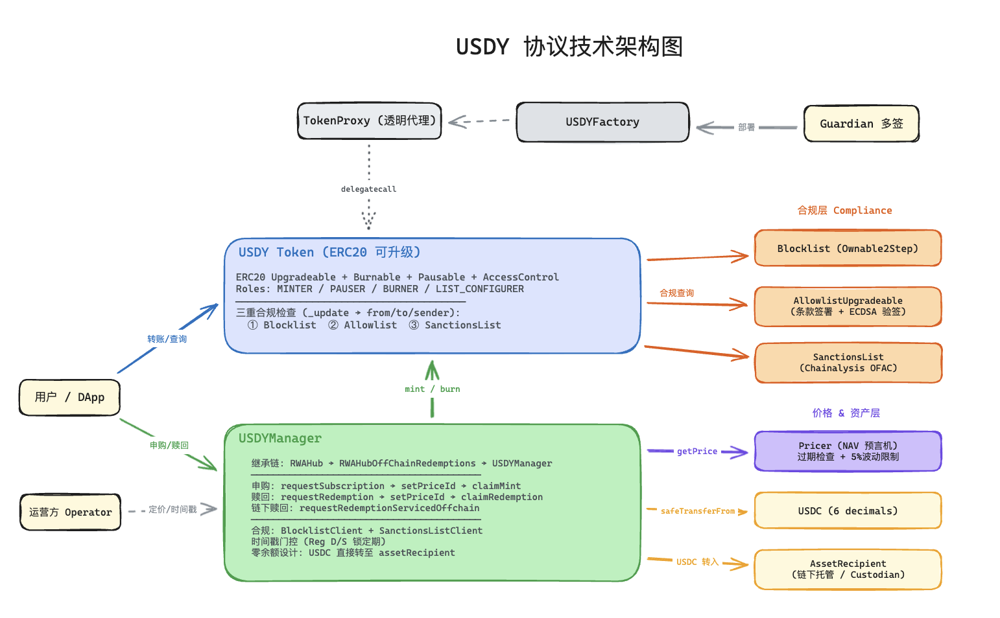

# Ondo Finance — 技术架构（源码级分析）

> 源码仓库：https://github.com/ondoprotocol/usdy
> 调研时间：2026-03-02

---

## 合约层次结构

```
USDY.sol（Token）
  ├── ERC20PresetMinterPauserUpgradeable
  ├── BlocklistClientUpgradeable        ← 内部黑名单
  ├── AllowlistClientUpgradeable        ← KYC 白名单
  └── SanctionsListClientUpgradeable    ← Chainalysis 链上制裁名单

USDYManager.sol（业务入口，继承 RWAHub）
  ├── RWAHubOffChainRedemptions
  ├── BlocklistClient
  └── SanctionsListClient

RWAHub.sol（抽象基类）
  ├── requestSubscription()
  ├── claimMint()
  ├── requestRedemption()
  ├── claimRedemption()
  └── setPriceIdForDeposits/Redemptions()

Pricer.sol（价格管理）
  └── priceId → { price, timestamp }

PricerWithOracle.sol（继承 Pricer）
  └── 每次 addPrice 同步更新 RWAOracle（Chainlink 兼容格式）
```



---

## 核心设计：PriceId 快照系统

**这是 Ondo 最关键的技术设计，解决了定价公平性问题。**

### 问题背景

如果用 fulfill 时刻的实时 NAV 定价，operator 可以择机执行，存在利益冲突；同一天不同用户用不同价格也不公平。

### PriceId 方案

```
Step 1 — 用户 requestSubscription(amount)
  → USDC 直转 Coinbase 存款地址
  → 生成 depositId，priceId = 0（待绑定）

Step 2 — Operator addPrice(nav, timestamp)
  → 在 Pricer 合约生成全局唯一 priceId
  → 价格永久记录，不可修改

Step 3 — Operator setPriceIdForDeposits([depositId], [priceId])
  → 把订单和价格快照绑定（绑定后不可修改）

Step 4 — 用户 claimMint([depositId])
  → 读取绑定的 priceId 对应价格
  → 按价格 mint token，用户主动 pull
```

### 关键特性

- priceId 一旦绑定 → 不可修改，防止 operator 事后改价
- Pull 模型 → 用户主动 claim，operator 无法强制 push
- 同一 priceId 可对应多个 depositId → 批量公平定价

---

## 资金流转：零余额合约设计

```solidity
// RWAHub.sol — 硬编码 Coinbase 存款地址
address public constant assetRecipient =
    0xbDa73A0F13958ee444e0782E1768aB4B76EdaE28;

function requestSubscription(uint256 amount) external {
    ...
    // USDC 直接转到 Coinbase，合约永远不持有用户资金
    collateral.safeTransferFrom(msg.sender, assetRecipient, depositAmountAfterFee);
}
```

赎回时，USDC 由 `assetSender`（operator 运营钱包）直接转给用户：

```solidity
// claimRedemption — 从 assetSender 拉款，不经过合约
collateral.safeTransferFrom(assetSender, member.user, collateralDuePostFees);
```

**安全收益：** 合约无余额 → 被攻击也无法直接提走资产。

---

## 三层合规架构（USDY Token）

```solidity
contract USDY is
    ERC20PresetMinterPauserUpgradeable,
    BlocklistClientUpgradeable,       // 层 1：内部黑名单
    AllowlistClientUpgradeable,       // 层 2：KYC 白名单
    SanctionsListClientUpgradeable    // 层 3：Chainalysis 实时制裁名单
{
    function _beforeTokenTransfer(address from, address to, uint256 amount) {
        // 检查 from：非黑名单、非制裁、已 KYC
        // 检查 to：非黑名单、非制裁、已 KYC
        // 检查 msg.sender（transferFrom 场景）：同上三项
        // → 防止未授权中间方代为操作
    }
}
```

三个合规模块独立部署，可单独升级：

- **Allowlist** — Ondo 手动维护，KYC 审核通过后写入
- **Blocklist** — Ondo 主动封禁（如违规用户）
- **SanctionsList** — 接入 Chainalysis 链上合约，OFAC 制裁名单实时自动同步

---

## T+1 链上强制实现（USDYManager）

```solidity
// USDYManager.sol
mapping(bytes32 => uint256) public depositIdToClaimableTimestamp;

// Operator 为每批订单设置可 claim 时间（必须是未来时间）
function setClaimableTimestamp(uint256 claimTimestamp, bytes32[] calldata depositIds) {
    require(claimTimestamp > block.timestamp);
    for each depositId → depositIdToClaimableTimestamp[depositId] = claimTimestamp;
}

// 用户 claim 时检查
function _claimMint(bytes32 depositId) internal override {
    if (depositIdToClaimableTimestamp[depositId] == 0) revert;       // 未设置
    if (depositIdToClaimableTimestamp[depositId] > block.timestamp) revert; // 未到时间
    super._claimMint(depositId);
}
```

T+1 约束从「相信 operator 不作恶」变成「链上时间强制」，可审计。

---

## Pricer → RWAOracle → DeFi 数据链

```
Operator addPrice(nav, t)
    ↓
PricerWithOracle 验证：上一次 oracle 价格 == Pricer 记录的上一次价格
    ↓
写入 RWAOracle（Chainlink AggregatorV3 格式）
    ↓
DeFi 协议（Pendle / Morpho / Curve）读取 NAV 价格
```

Ondo 的 oracle 不是被 Chainlink 喂价，而是自己写入 Chainlink 兼容格式，对外广播。


---

## 参考资料

- 源码：https://github.com/ondoprotocol/usdy
- 文档：https://docs.ondo.finance
- 审计报告：https://docs.ondo.finance/audits
- Code4rena 2023 审计报告（推荐阅读）：https://code4rena.com/reports/2023-09-ondo/
